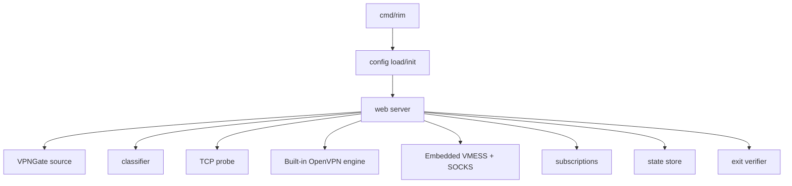

# Architecture

## Goals

- Keep the Go entrypoint small and predictable.
- Separate config, web UI, service orchestration, and external adapters.
- Make the control plane portable across Linux, macOS, and Windows.
- Treat VPNGate profiles and public IP checks as untrusted inputs.
- Present one gateway mode that works for local, LAN, and public subscribers.

## Layout

```text
cmd/rim            CLI entrypoint
internal/config     JSON config loading, validation, and defaults
internal/web        HTTP server, HTML console, login, APIs, subscriptions
internal/source     VPNGate fetching
internal/classify   Residential-IP classification
internal/probe      TCP probing
internal/tunnel     In-process OpenVPN and userspace TCP/IP stack
internal/proxycore  Embedded VMESS and local SOCKS management
internal/subscription  VMESS and Clash subscription generation
internal/verify     Exit-IP verification
internal/storage    JSON state persistence
internal/service    systemd, launchd, and Windows service templates
```

## Runtime Flow



The HTTP server owns the request lifecycle. It loads config, restores state, serves the console, and coordinates node refresh, classification, probing, connection, verification, and subscription generation.

## State Model

- Node data and connection snapshots live in local JSON storage.
- Sessions are cookie-based and expire server-side.
- Subscription access is token-based and independent from the console login.
- Failover is conservative: failed nodes cool down before the next attempt.
- The Web service monitors a connected data path and automatically selects a cached candidate if it stops.

## Deployment Model

- `rim serve` runs the control plane.
- `rim config init` creates a secure starter config.
- `rim service generate` emits platform-specific service wrappers.
- `scripts/build_go.sh` and `scripts/build_go.ps1` package release artifacts.
- Release packages contain only the target `rim` binary, configuration/documentation, and service templates. Protocol engines and the Web UI are linked into the binary.

## Data Paths

```text
local app -> 127.0.0.1:1080 SOCKS -> embedded proxy core
remote VMESS client -> host:10086 -> embedded proxy core
embedded proxy core -> userspace TCP/IP stack -> built-in OpenVPN -> VPNGate -> Internet
```

The VPN is intentionally a proxy egress, not an operating-system-wide route. This avoids TUN drivers and elevated privileges on all supported platforms.
